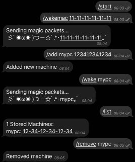

# ( ≧▽≦) WOLBOT (≧▽≦ )

Simple Wake-on-Lan Telegram bot



## 彡ﾟ◉ω◉ )つー☆ﾟ.*･Commands｡ﾟ'

> See `/help` for a list of available commands

## 彡ﾟ◉ω◉ )つー☆ﾟ.*･Requirements｡ﾟ'
- python 3
- python-telegram-bot
- Virtualenv (recommended)

## 彡ﾟ◉ω◉ )つー☆ﾟ.*･Installation｡ﾟ'

Clone the repository
```
# mkdir -p /opt/wolbot
# chown -R user:group /opt/wolbot
$ git clone url /opt/wolbot
$ cd /opt/wolbot
```

Edit the config with your favorite editor (aka `vim`)
```
$ cp config.example.py config.py
$ vim config.py
```

Set up the Python environment
```
$ virtualenv wolbot_venv
$ source wolbot_venv/bin/activate
(venv)$ pip install -r requirements.txt
```

Start the application
```
(venv)$ python3 wolbot.py
```

